1.电路的基本概念与基本定律

# 1.1电路的组成、作用及电路模型

## 1.电路的概念

电路是由若干具有一定功能的元器件组成的电流通路。

> 复杂电路：电网络

## 2.组成部分

电源（信号源）、中间环节、负载

## 3.作用

* 电能的传输与转换（强电，电压高、电流大）

  > 电源：供应电能的设备，将其他能转换为电能，发电机、电池
  >
  > 负载：取用电能的设备，将电能转换为其他能，电动机、电灯
  >
  > 中间环节：连接电源和负载的部分，起传输和分配电能的作用，变压器、输电线
  >
  > 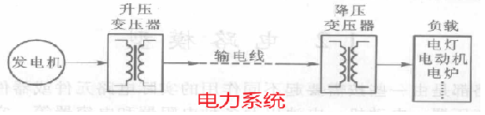 

* 信号的传递与处理（弱电，电压低、电流小）

  > 信号源：输出信号的设备，将信息（声音等）转换为电信号（电压、电流），话筒
  >
  > 负载：接受和转换信号的设备，将电信号还原为信息，扬声器
  >
  > 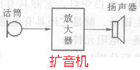 

**激励**：电源（信号源）产生的电压或电流

**响应**：由激励在电路各部分产生的电压和电流

**电路分析**：在已知电路的结构和元器件参数的条件下，分析电路的激励和响应之间的关系。

## 4.电路模型

* **实际电路**：由不同作用的实际电路元器件组成的电路

* **理想元件**：突出某一元件主要的电磁特性，忽略其次要因素的电路元件，分别用规定的图形符号和相应的参数来表征

* **模型化**：用理想元件的组合来抽象模拟实际电路

* **电路模型**：由理想元件构成的，能反应实际电路特性的电路

  实际电路（复杂系统） $\underrightarrow{模型化}$  模型 $\underrightarrow{研究解决}$ 实际问题

  模型化的“好坏”，直接决定了 电路模型 是否能完整代替 实际电路

* 实际元件的多个不可忽略的电磁特性，需用多个理想元件来代替

# 1.2电路的基本物理量及参考方向

## 1.电流(I)

* 电流的概念：单位时间内穿过某一横截面的电荷量

一般式 $i = \frac{dq}{dt}$

直流 $I = \frac{Q}{t}$ （单位时间内穿过某一横截面的电荷量是固定的）

* 现象：电荷的定向移动（导体中的电子定向移动）

* 大小：电流强度

* 分类：直流、交流、任意变化

* 单位：

  $10^{-9} nA (纳安) = 10^{-6} uA (微安)  = 10^{-3} mA (毫安) = 1A (安培) = 10^3 kA (千安) = 10^6 MA (兆安)$

* 方向：

  * 实际方向：正电荷移动的方向

    与电子（负电荷）移动方向相反

  * 参考方向（正方向）：人为假设的电流方向 $$\begin{cases} I>0 (实际与参考方向相同), \\ I<0 (实际与参考方向不同) \end{cases}$$

    参考方向选定后，电流才有正、负值之分

    * 箭头法：$\underrightarrow{I}$
    * 脚标法: $$\left. \begin{array}{l} a \rightarrow b: I_{ab} \\ b \rightarrow a: I_{ba} \end{array} \right\} I_{ab}= -I_{ba}$$

## 2.电压(U)

* 电压的概念：两点之间的电位差

  衡量电场力对正电荷做功的能力

$U_{ab} = V_a -V_b = \frac{dw}{dq}$

> w——功，J(焦耳)
>
> q——电荷，C(库伦)
>
> V——电位，V(伏特)
>
> U——电压，V(伏特)

* 实际方向：沿着电场正电荷失去能量的方向（电位降低的方向）

* 参考方向：人为假设的电压方向 $$\begin{cases} U>0 (实际与参考方向相同), \\ U<0 (实际与参考方向不同) \end{cases}$$
  * 箭头法：$\underrightarrow{U}$
  * 脚标法: $$\left. \begin{array}{l} a \rightarrow b: U_{ab} \\ b \rightarrow a: U_{ba} \end{array} \right\} U_{ab}= -U_{ba}$$

* 电位（电势）：单位正电荷在电场中具有的能量
  * $$零电位 \begin{cases} 无穷远点[物理], \\ 人为规定的电路中某一点(参考电位)[电路] \end{cases}$$
  * 其他点的电位 与 参考电位 比较，高于参考电位则为正，低于参考电位则为负

## 3.电动势(E)

* 电动势的概念：衡量非电场力（电源力）对正电荷做功的能力

* 实际方向：经电源内部由低电位指向高电位的方向（电源内部负极指向正极）

  正电荷经电源内部获得能量的方向

  电位升高的方向

* 知道电源就知道电动势的实际方向，没有必要人为假设参考方向。

## 4.功率

* 功率的概念：单位时间内电路元件中电能的变化

$p = \frac{dw}{dt}$

$p = \frac{dw}{dq} \cdot \frac{dq}{dt} = u \cdot i$

直流 $P=U \cdot I$

* 功率吸收与发出的判断：

  * U、I 实际方向已知：

    * 相同——电流由高电位流向低电位——正电荷失去能量——元件吸收功率——元件为负载
    * 不同——电流由低电位流向高电位——正电荷获得能量——元件发出功率——元件为电源

  * U、I 参考方向已知：

    * 相同（关联参考方向）

      $$p = u \cdot i \begin{cases} >0 元件吸收功率,元件为负载 \\ <0 元件发出功率,元件为电源 \end{cases}$$

    * 不同（非关联参考方向）

      $$p = u \cdot i \begin{cases} >0 元件发出功率,元件为电源 \\ <0 元件吸收功率,元件为负载 \end{cases}$$

    > 关联的参考方向：对于电阻元件，电压的参考方向和电流的参考方向相同

* 功率平衡关系（由能量守恒定律）

  检验电路分析的结果是否正确

  $\sum{p_吸} = \sum{p_发}$

* 问：是否所有电源在电路中都起到电源作用？

  否，有些电源在电路中起到负载作用（充电电路）

  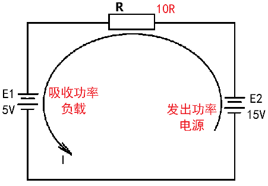 

* 例：判断电路元件是电源还是负载？

  **电流在电源内部从低电位流向高电位，吸收电源的功率**

  **电流在负载内部从高电位流向低电位，发出功率**

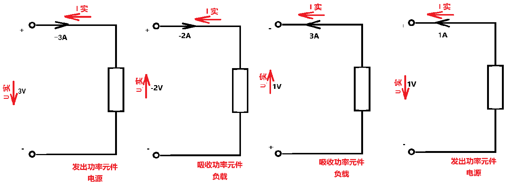 

* 例：判断电路电压源和电流源分别是电源还是负载？

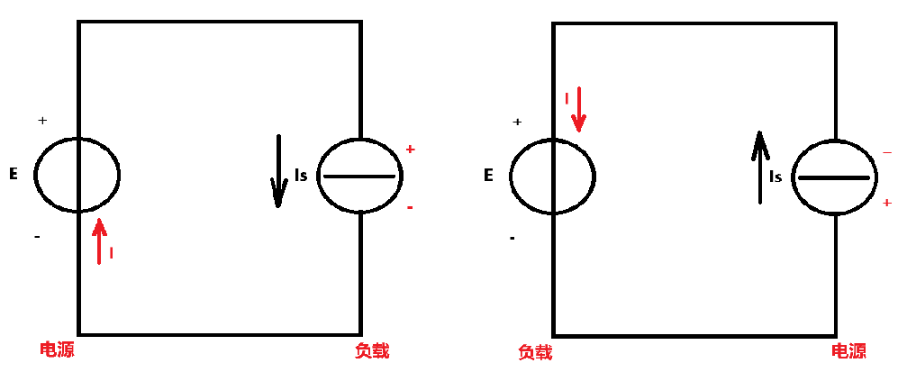 

# 1.3基本电路元件

## 1.3.1无源元件

### 1.电阻元件

* 线性电阻 （u、i 成正比）

  **欧姆定律**：$R= \frac{U}{I}$

  $R=\rho \cdot \frac{l}{s} $

  $U= R \cdot I$ （**电阻元件约束**）

  特性曲线

  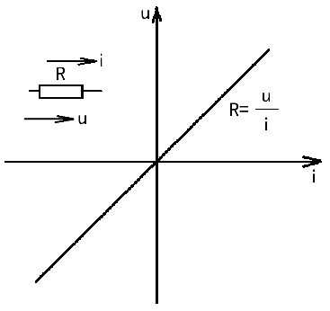 

  $\int_0^t u \cdot i dt= \int_0^t i \cdot R \cdot i dt = \int_0^t i^2 \cdot R dt$ 在0-t内对功率 $p= u \cdot i$ 求导等于消耗的电能

  **电阻元件是耗能元件（热辐射）**

* 非线性电阻 （u、i 不成正比）

  表示符号 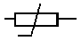

  （白炽灯）

  不满足欧姆定律，只能通过曲线或函数式来表达 u、i 关系

  特性曲线

  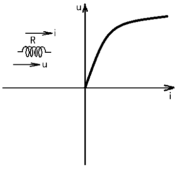 

  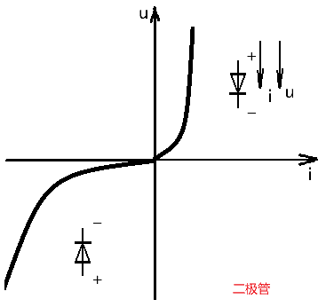 

### 2.电感元件

* 线性电感 （i、$\varphi$ 成正比）

  电感：单位电流在线圈中产生的磁通的大小

  一般式 $L=\frac{N \cdot \varphi}{i}$

  $L=\frac{u \cdot S \cdot N^2}{l}$

  > $u$ ——电感的磁导率
  >
  > S——导线的横截面积
  >
  > $l$ ——电感绕组的长度
  >
  > N——绕组的匝数

  表示符号 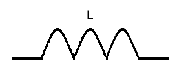

  方向：通过 右手螺旋定则 

  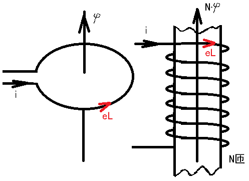 

  单位：$10^{-6}uH(微亨)= 10^{-3}mH(毫亨)= 1H(亨利)$

  

  电感中的磁通发生变化，即电流变化，线圈中会产生阻止磁通变化的感应电动势，也叫自感电动势。

  自感电动势的方向与电感的方向相反。

  $e_L=- \frac{d(N \cdot \varphi)}{dt}= -L \cdot \frac{di}{dt}$

  

  

  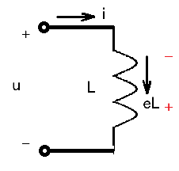 

  $u+e_L= 0$ 

  $\Rightarrow u= -e_L$

  $\Rightarrow u=L \cdot \frac{di}{dt}$  (**电感元件约束**)

  在直流电路中，$\frac{di}{dt}=0$ ,此时电感相当于一段没有电阻的导线？？？

  $\int_0^t u \cdot i dt= \int_0^t L \cdot \frac{di}{dt} \cdot i dt = \int_0^i L \cdot idt =\frac{1}{2} L i^2$  **电感元件为储能元件（磁场）**

  

* 非线性电感（i、$\varphi$ 不成正比）

  表示符号 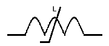

  只能通过曲线或函数式来表达 i、$\varphi$  关系

### 3.电容元件

* 线性电容 （q、u成正比）

  $C=\frac{q}{u}$

  $C=\frac{\varepsilon \cdot S}{d}$

  > $\varepsilon$ ——介电常数
  >
  > S——电容棘板面积
  >
  > d——电容棘板间距

  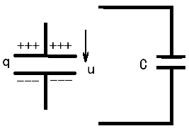 

  单位：$10^{-12}pF(皮法)= 10^{-6}uF(微法)= 1F(法拉)$

  $i=\frac{dq}{dt}= C \cdot \frac{du}{dt}$ （**电容元件约束**）

  在直流电路中，$\frac{du}{dt}=0$ ，此时电容相当于断路。

  $\int_0^t u \cdot i dt= \int_0^t C \cdot \frac{du}{dt} \cdot u dt = \int_0^u C \cdot u dt =\frac{1}{2} c u^2$  **电容元件为储能元件（电场）**

  

* 非线性电容（q、u不成正比）

  表示符号 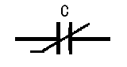

## 1.3.2有源元件

### 1.独立电源

#### 1)理想电源

* 理想电压源（恒压源）：两端电压恒定（大小、方向）

  表示符号 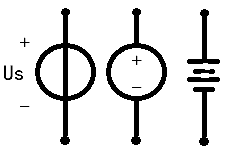

  特性曲线

  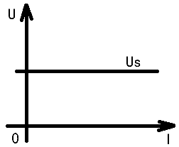 

  其中的电流与外电路有关

* 理想电流源（恒流源）：输出的电流恒定（大小、方向）

  表示符号 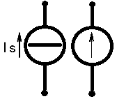

  特性曲线

  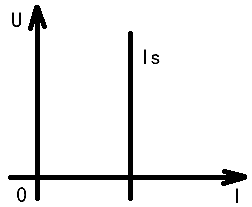 

  其两端电压与外电路有关

#### 2)实际电源

* 实际电压源：两端电压随电流增大而减小

  表示符号 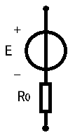

  特性曲线

  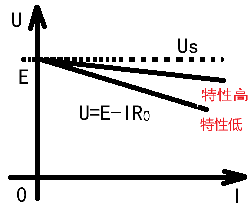 

  下降越快，电源的特性越低，不利用使用

  当 $R_0= 0$ ，实际电压源 $\approx$ 理想电压源

* 实际电流源：输出电流随端电压增大而减小

  表示符号 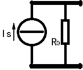

  特性曲线

  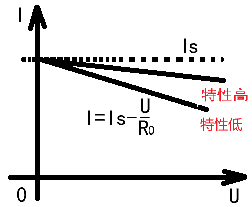 

  当 $R_0 \rightarrow \infty$ ，实际电流源 $\approx$ 理想电压源

  

* 例：电源内阻 $R_0 << R_L$ ，该电源接近恒压源还是恒流源？如 $R_0 >> R_L$ 呢？

  解：

  以实际电压源形式表示：$U= \frac{E}{R_0 + R_L} \cdot R_L$ ，

  ​        当 $R_0 << R_L$ ，$U \approx E$ ，接近恒压源

  ​        当 $R_0 >> R_L$ ，$U \approx \frac{E}{R_0}$ ，接近恒流源

  以实际电流源形式表示：$U= I_S \cdot \frac{R_0 \cdot R_L}{R_0 + R_L}$ ，

  ​        当 $R_0 << R_L$ ，$U \approx I_S \cdot R_0$ ，接近恒压源

  ​        当 $R_0 >> R_L$ ，$U \approx I_S$ ，接近恒流源

  结论：实际电源的性质，并不是由其理想电源模型决定，而是由其内部参数决定。

### 2.受控电源

* 概念：电源的某一参数受其他某一个参数控制

* 分类：
  * 受电压控制的电压源（压控电压源）：VCVS
  
  * 受电压控制的电流源（压控电流源）：VCCS
  
  * 受电流控制的电压源（流控电压源）：CCVS
  
  * 受电流控制的电流源（流控电流源）：CCCS
  
    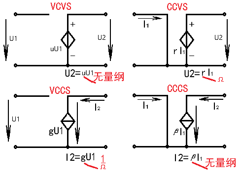 
    
# 1.4电路的三种工作状态

## 1.有载(闭路)

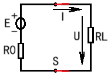 

$I=\frac{E}{R_L+ R_0}$

$U= E- IR_0$

$P= UI= P_E- \Delta P= EI- I^2R_0$

## 2.空载(开路)

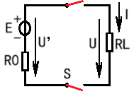 

$I= 0$

$U= 0$

$P= 0$

$U'= E$  (即开路电压$U_0$)，电源端没有功率损耗，因为没有电流

## 3.短路

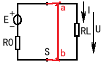 

$I_{ab}= \frac{E}{R_0}$ ，电流从短路处流通，不再流入负载端。一般电源内阻 $R_0$ 很小，则$I_{ab}$ 极大，可能损坏电源。

$U= 0$

$P= 0$

$P_E= \Delta p= I_{ab}^2R_0$ ，电源功率全损失在内阻，且损失功率极大。

**短路可能发生在电路的任意部位**

**狭义上，电源的短路，极易损坏电源，尽量避免**；

**广义上，由于某种需要（测试），人为短接元件，一定要仔细分析是否会造成其他元件的损伤**

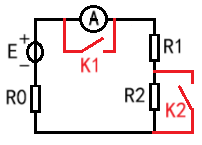 

* **额定值**：$U_N$ 、$I_N$ 、$P_N$ 生产厂家根据元件工作的安全、可靠、经济、寿命等角度，人为规定值。
* 实际值：
  * **等于额定值工作：满载**；
  * 低于额定值工作：轻载
  * 高于额定值工作：过载

# 1.5电路的基本定律

## 1.名词定义

* 支路（b, branch）：流过同一电流的一段电路。
* 节点（n, node）：三个或以上支路的交汇点。
  * 对于电路分析，一段空的导线（其理想元件的电阻为0）两端点视为一个节点。
* 回路（l, loop）：由支路围绕组成的闭合路径。

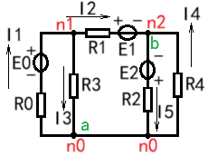  $\begin{cases} b=5 \\ n=3 \\ l=6 \end{cases}$

## 2.基尔霍夫电流定律(KCL)

* 内容：在任一瞬时，流入电路任一节点中的电流与流出该节点的电流相等。

  $\sum{I_入} = \sum{I_出}$

  在任一瞬时，流入某节点电流的代数和为零。

  $\sum{I}= \sum{I_入} +(- \sum{I_出})= 0$  （**电流的节点约束**）

  > 流入与流出电流的方向相反，设流入电流为正、流出电流为负。

* 本质：在任一瞬时，节点上电荷具有连续性（不会突变）

  节点n0：$-I_1+ I_3+ I_5- I_4= 0$

  节点n1：$I_1- I_2- I_3= 0$

  节点n2：$I_2+ I_4- I_5= 0$

* 推广：**节点（狭义）——> 闭合面（广义）**

  将n1、n2加起来 == 将n1、n2支路上的元件忽略当成一个节点：

  $I_1- I_3- I_5+ I_4= 0$

## 3.基尔霍夫电压定律(KVL)

* 内容：在任一瞬时，沿回路的任意循行（顺、逆时针绕行）方向电压(位)降之和等于电压(位)升之和。

  $\sum{U_降} = \sum{U_升}$  ( $\sum{V_降} = \sum{V_升}$ )

  在任一瞬时，沿回路的任意循行方向电压的代数和为零

  $\sum{U}= \sum{U_降} +(- \sum{U_升})= 0$  （**电压的回路约束**）

  > 电位降为电压方向
  >
  > 设与循行方向一致的电压为正、与循行方向相反的电压为负

* 本质：在任一瞬时，电路任意点电位具有单值性

  回路n0、n1、n2、n0：$-I_3R_3+ I_2R_1+ E_1- E_2+ I_5R_2=0$

* 推广：**回路（狭义）——> 开口循行回路（广义）**

  开口循行回路a、n1、b：$-I_3R_3+ I_2R_1+ E_1+ U_{ba}= 0$

  $U_{ba}= -E_2+ I_5R_2$

（**电路结构（拓扑）约束**：电流的节点约束 $\sum{I}= 0$ 、电压的回路约束 $\sum{U}= 0$ ）

## 4.适用范围

* 任一瞬时
* 任意变化u、i（波形任意）
* 任意元件

* 例：求各电阻电压和电流

  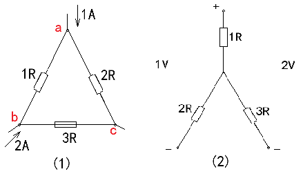 

# 1.6电路中电位的分析和计算

* 电位（势）：电场力把单位正电荷移向某一参考点所做的功

  * 物理上，参考点为无穷远点

  * 电路中，参考点为**任意点**，设其电位为0（零电位点），标记为 $\bot$ ，*并不一定是接地，只是认为是零电位点*

    > 高于参考点电位为正
    >
    > 低于参考点电位为负

* 例：分析以下电路各点电位、各支路电压

  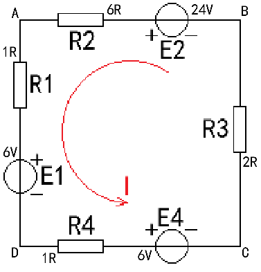 

  解：设电流参考方向为逆时针

  $I= \frac{E_2- E_1- E_4}{R_2+ R_1+ R_4+ R_3}= \frac{24-6-6}{6+1+1+2}= 1.2A$

  * 设D为参考点（零电位点），则：

    $V_A= 6+1 \cdot 1.2= 7.2V$ 、 $V_B= V_A + 6 \cdot 1.2- 24= -9.6V$  、 $V_C= -1 \cdot 1.2- 6= -7.2V$ 、 $V_D= 0V$ 

    $U_{AB}= V_A- V_B= 16.8V$ 、 $U_{BC}=V_B- V_C= -2.4V$ 、 $U_{CD}=V_C- V_D= -7.2V$ 、 $U_{DA}= V_D- V_A= -7.2V$

  * 设A为参考点（零电位点），则：

    $V_A= 0V$ 、 $V_B= 6 \cdot 1.2- 24= -16.8V$ 、 $V_C= V_B+ 2 \cdot 1.2= -14.4V$ 、 $V_D= -1 \cdot 1.2- 6= -7.2V$

    $U_{AB}= V_A- V_B= 16.8V$ 、 $U_{BC}=V_B- V_C= -2.4V$ 、 $U_{CD}=V_C- V_D= -7.2V$ 、 $U_{DA}= V_D- V_A= -7.2V$

  * **结论**：1)、参考点位置可任意选择；2)、参考点确定，各点电位确定；3)、参考点不同，各点电位不同，但两点间电压相同。

    **电位与参考点有关，电压与参考点无关（电位是相对的，电压是绝对的）**

    选择支路比较多的节点为零电位点，计算比较方便

  * 电路中可以省去电源，而是用电源的电位表示。

    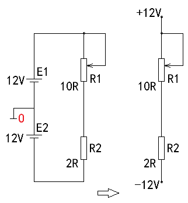 