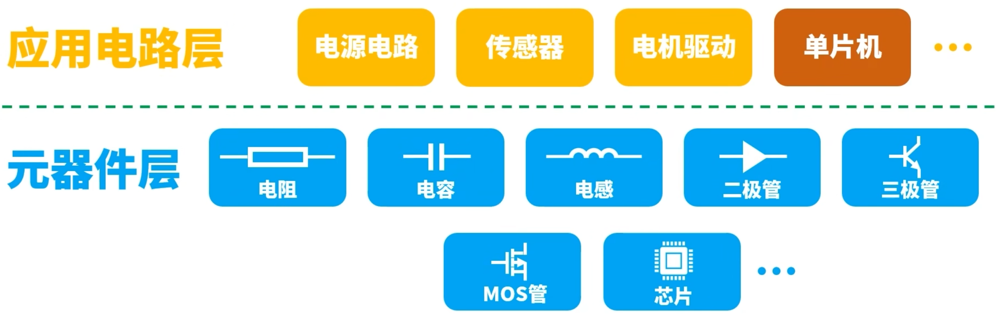
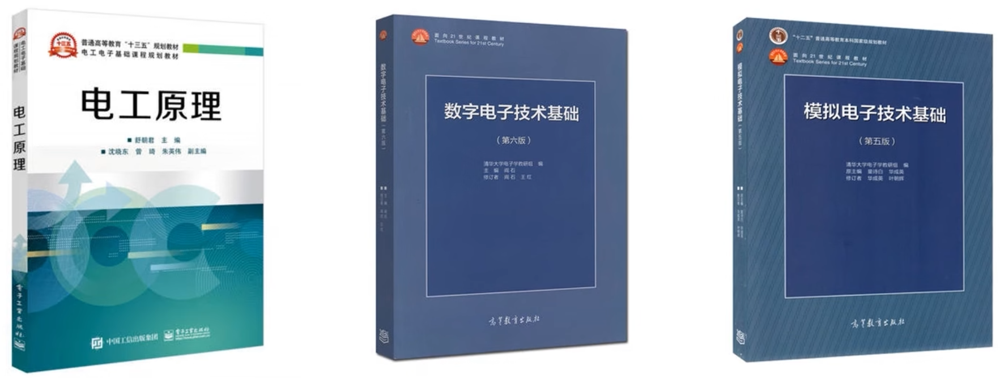
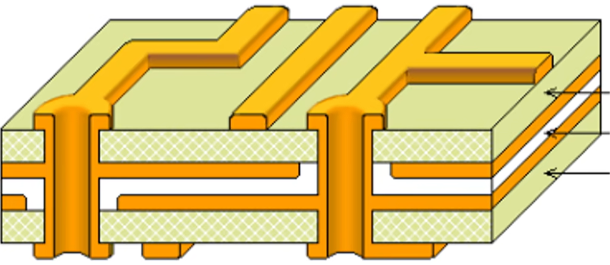
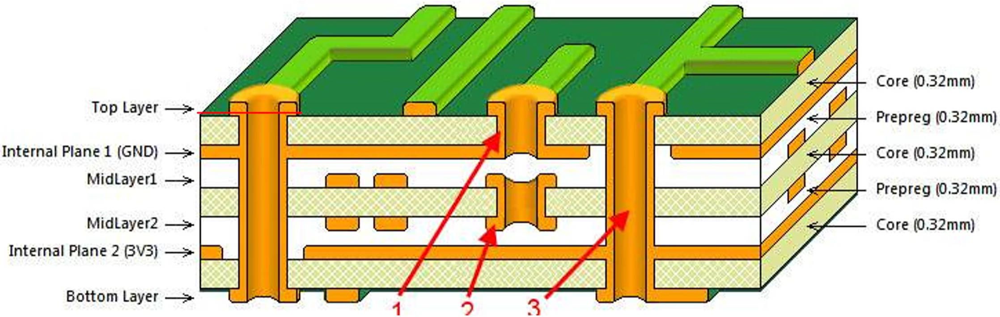
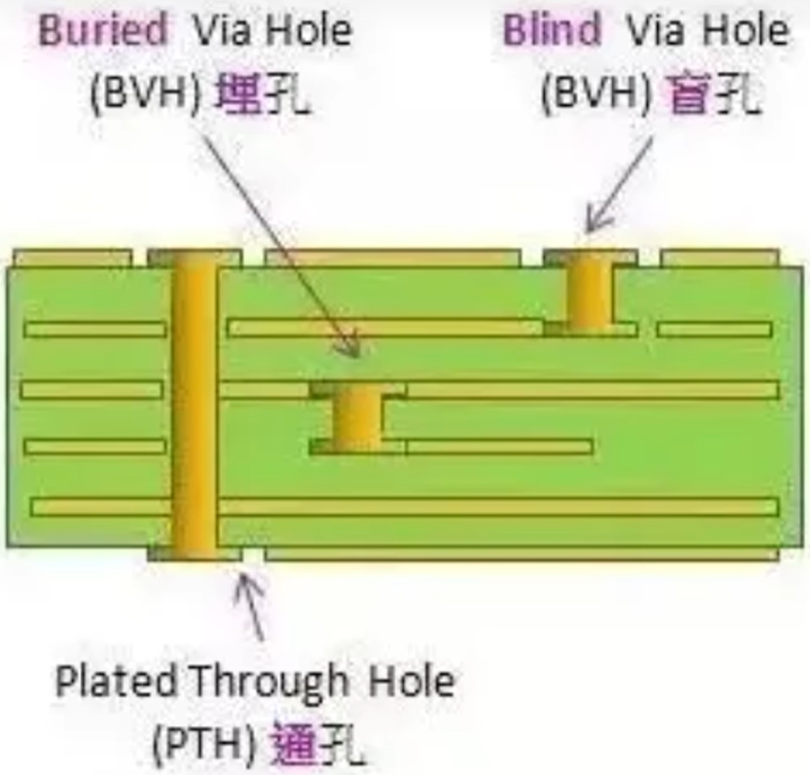

# 0.学习方法

硬件学习框图

>  

第一步：粗略学习基础元器件

>  
>
> 带着实践中的问题去看书

第二步：学习单片机

> 硬件
>
> > 微机原理、单片机原理
> >
> > 外设接口、功能模块
>
> 软件
>
> > 编程语言：汇编、C/C++
> >
> > 进阶：编译原理、实时操作系统FreeRtos

第三步：学习应用电路，加强对基础元器件的认知

**学习要点**：往复学习、实践

**其他内容**：仪器的使用、焊接、数据手册、EDA软件的使用

[嘉立创EDA-PCB设计零基础入门课程（54集全）_哔哩哔哩_bilibili](https://www.bilibili.com/video/BV1fM411Z7cW?spm_id_from=333.788.videopod.episodes&vd_source=b6cd6dd41c0769968f58ce886d249f74)

# 一、PCB设计环境

# 二、PCB印制电路板

## 1、定义：

PCB (Printed Circuit Board) ，印制电路板，或印刷线路板

是电子产品中的重要部件，**元器件的支撑体，更是实现诸多电子元器件电气连接的载体**。

类似于纸张印刷，PCB也是印刷出来的，采用电子印刷术，所以称之为印刷电路板。

## 2、发展史

刚开始，使用导线连接所有电子元器件

制作方法：

(1) **减去法**：把不需要的金属腐蚀掉 (保罗.爱斯勒，奥地利，1936)

(2) 加成法：只加上所需配线 (宫本喜之助，日本，1936)

## 3、PCB的层叠结构

3.1、单层板

3层结构：

(1) 顶层阻焊 (绿油，绝缘) ：防止漏电、保护线路、防止焊锡接触线路；顶层丝印层

(2) 顶层线路 (铜，导电)

(3) 基板 (绝缘)

3.2、双层板

5层结构：

(1) 顶层阻焊 (绿油，绝缘) ；顶层丝印层

(2) 顶层线路 (铜，导电)

(3) 基板 (绝缘)

(4) 底层线路 (铜，导电)

(5) 底层阻焊 (绿油，绝缘) ；底层丝印层

3.3、四层板

双层板 (不要底层阻焊) +芯板 (绝缘) + (不要顶层阻焊) 双层板

 

3.4、六层板

双层板 (不要底层阻焊) +芯板 (绝缘) + (不要顶层阻焊) 双层板 (不要底层阻焊) +芯板 (绝缘) +(不要顶层阻焊) 双层板

 

**PCB一般设计成偶数层叠结构** 

三层板与四层板具有相同的制作过程，四层板两侧各冲压一层铜箔，三层板只有一侧冲压一层铜箔

三层板与四层板具有相同的价格，四层板比三层板多了一层铜箔和粘合层，成本差异不大，厂家以偶数层报价

四层板比三层板具有更好的过程稳定性，主要在对称性方面，四层板的翘曲度可控制在0.7%以下(ipc600标准)，而三层板在尺寸较大时，翘曲将超过该标准，这将影响SMT贴片和整个产品的可靠性。

**层叠结构越少就实现功能的PCB比更多层叠结构的PCB的布局和走线更好，多层板的设计是让布局和走线变简单的** 

## 4、通孔、盲孔、埋孔

**通孔**：在顶层与底层之间打孔，在孔内壁附上铜皮，可将顶层与底层之间的线路连接起来，实现了线路的换层

**盲孔**：在顶层与非底层之间打孔，在孔内壁附上铜皮，可将顶层与非底层之间的线路连接起来，实现了线路的换层

**埋孔**：在非顶层与非底层之间打孔，在孔内壁附上铜皮，可将非顶层与非底层之间的线路连接起来，实现了线路的换层

 

## 5、元器件的符号和封装

[立创商城_一站式电子元器件采购自营商城_嘉立创电子商城](https://www.szlcsc.com/?lcsc_vid=QFUPUlQHRwBcBVRSR1QMVlMAQQAKVlZWFQJeVAJREwIxVlNSTlRaU1RRT1BdUjsOAxUeFF5JWA0NAgAHWQIASA%3D%3D) 

