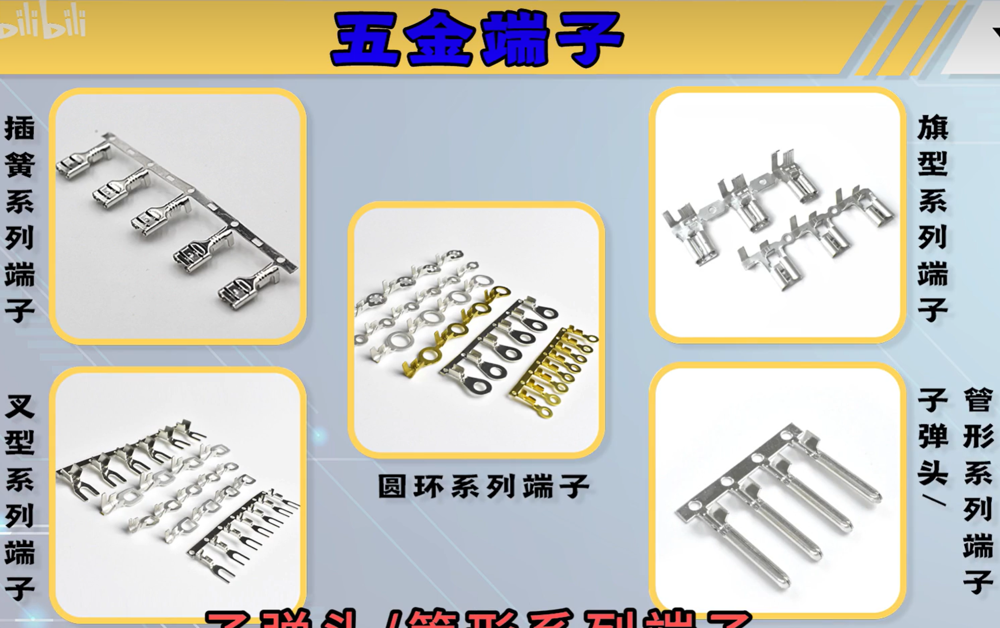
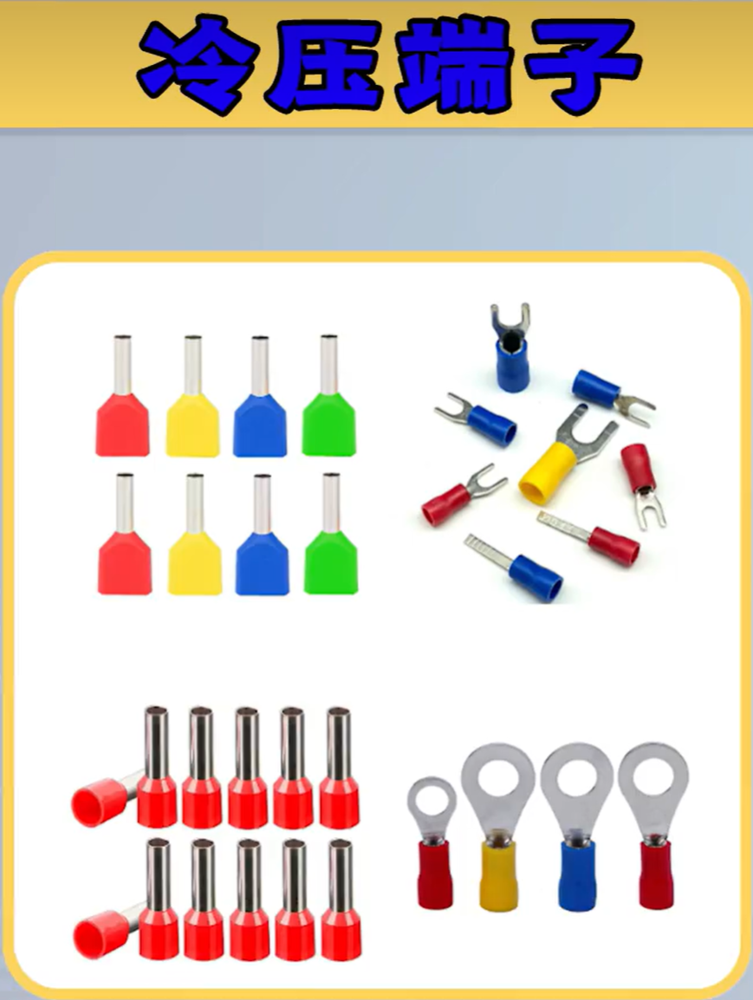
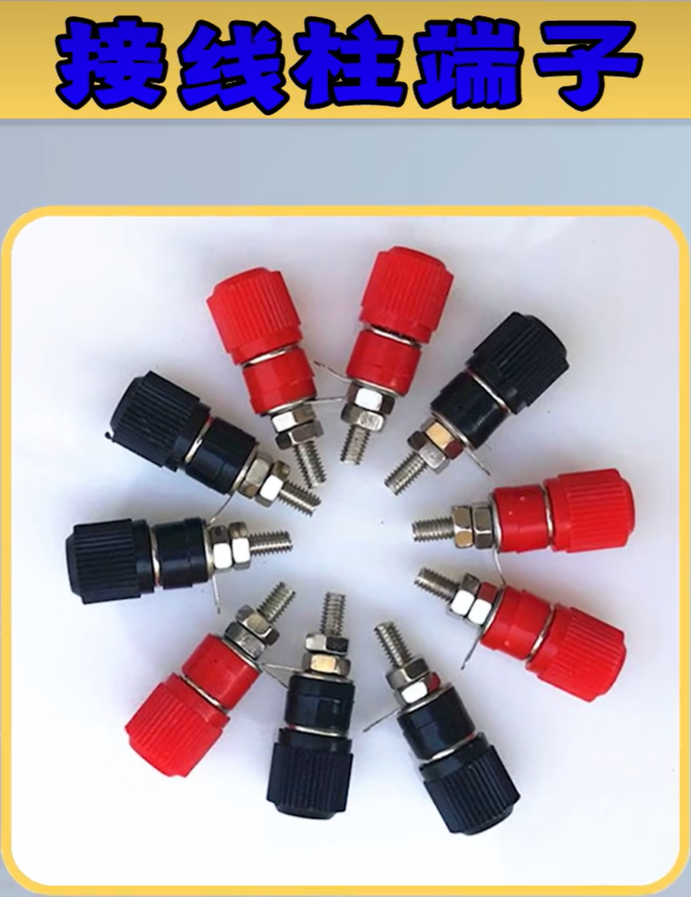
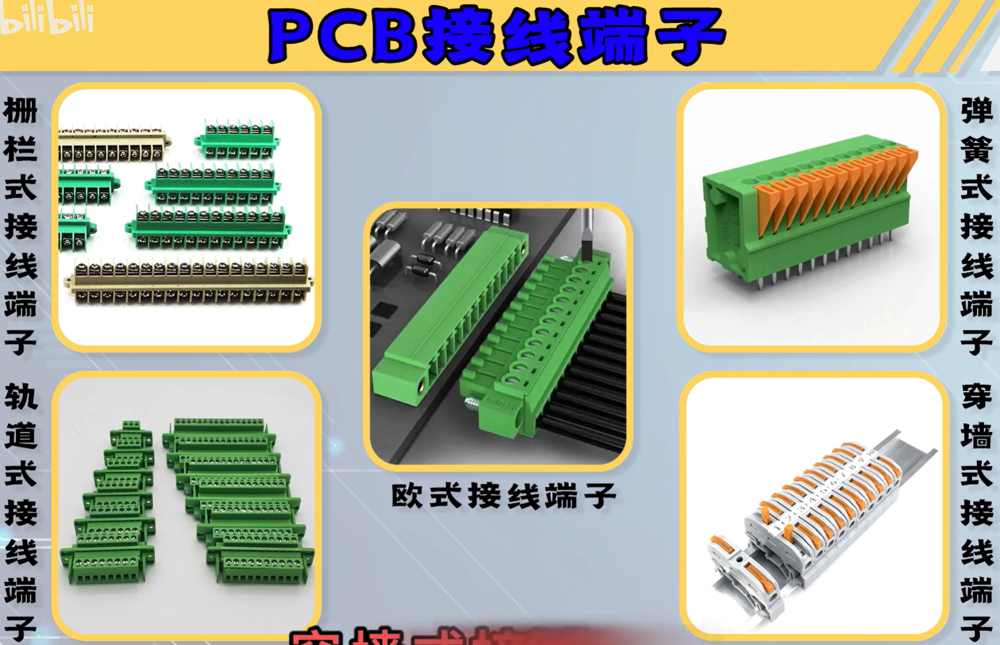

剥线钳、压线钳

电子线：AWG 18 号 特软硅胶线 红黑色，大电流正负极接线

​               AWG 22 号 特软硅胶线 红黑色，小电流正负极接线

​               AWG 26 号 特软硅胶线 除红黑外的六种色，信号线

XH 2.54接线端子、胶壳

杜邦2.54端子、胶壳

端子：是电线、电缆或电器器材上的接头

1、五金端子

 

2、冷压端子(绝缘端子)

 

3、接线柱端子

螺帽分为六角、梅花两种，一般镀镍或银，专供音响线连接

 

4、PCB接线端子

 