深圳市优信电子科技有限公司：电子元器件分类

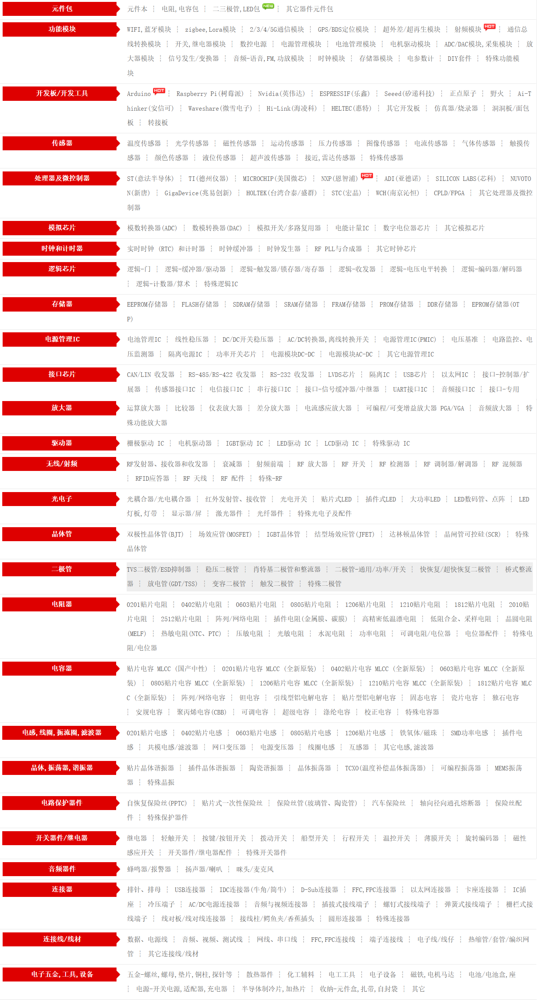 

[电子元器件+模拟电路硬件零基础入门，mos管三极管、电阻电容电感、电子元件、CircuitSimulator_哔哩哔哩_bilibili](https://www.bilibili.com/video/BV1ho9vYFE7b?spm_id_from=333.788.videopod.episodes&vd_source=b6cd6dd41c0769968f58ce886d249f74)

# 01、前置知识

## 01.1、原子结构

1、**碳原子**的简易模型

2、质子和中子**紧密结合**在一起

3、**质子数量**决定着**元素身份**

Proton--质子；Neutron--中子；Electron--电子

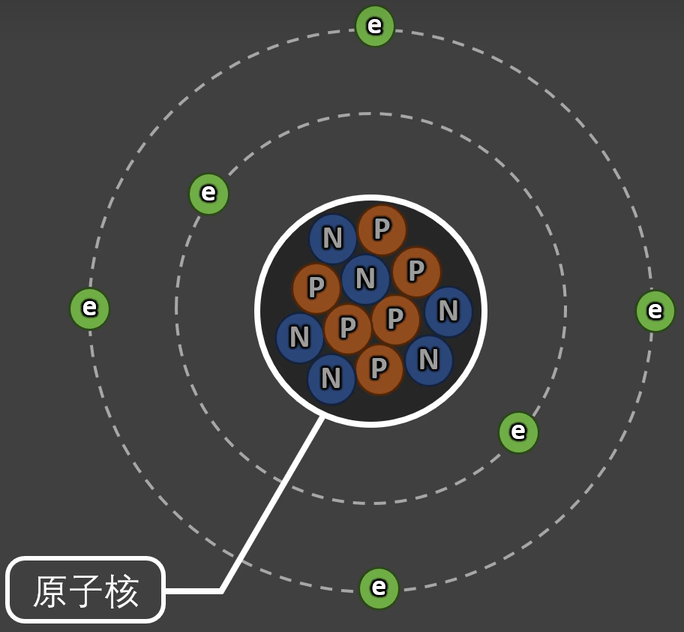 

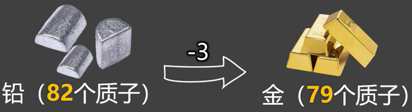 

01.1.1、关于中子

中子对原子的影响**远小于**质子，在**电学**领域，通常不对中子进行深入探讨

01.1.2、关于电子

​    1、每个**电子**带1个单位的**负电荷**

​    2、每个**质子**带1个单位的**正电荷**

​    3、中子**不带电**

电子围绕着原子核作无规则的运动，电子随机运动的概率区域叫作**电子层** (电子能量分布层，越往外能量越高)

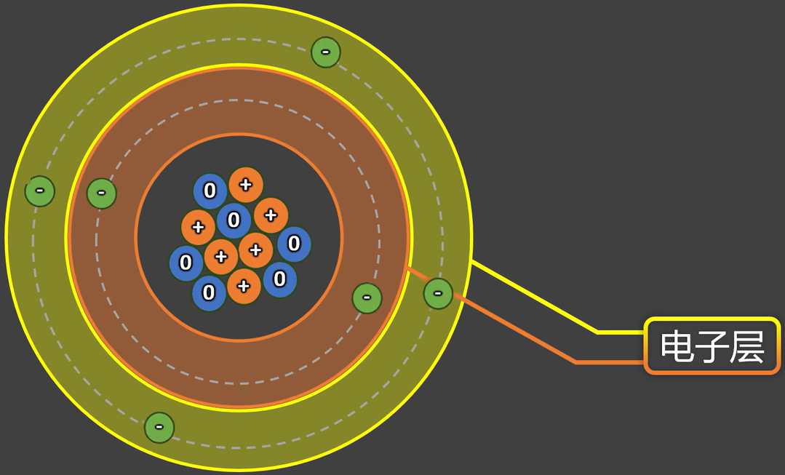 

​    4、每层最多能容纳的电子数： $2n^2$ 

​        为每层**理论上**的**极限值**，但是每层不一定都需要排满电子

​        第一层：$2*1^2=2$ 个

​        第二层：$2*2^2=8$ 个

​        第三层：$2*3^2=18$ 个

​        对于铁(Fe)，电子数为26，理论上应该为2，8，16 (错误)，但实际上为2，8，14，2

​        因为每个电子层又分为很多亚层，电子会根据能量由低到高排布，以达到原子整体能量最低

​    5、最外层电子数为**8**时，是较稳定的状态

​        发生化学反应时，通过得到或者失去电子，尽可能达到8个电子的稳定结构

​    6、**同种**电荷**互斥**，**异种**电荷**吸引**

​        质子之间距离太近了，产生了强相互作用力，远大于电荷之间的斥力和引力的，所以原子核如此稳定

​    7、库仑定律：$F=k \frac{|q_1 q_2|}{r^2}$

​        计算电荷之间的斥力和引力

​        其中，q1、q2指两个电荷的电荷量；r指两个电荷的距离；k指库伦常数，大小与介质有关

## 01.2、原子之间的组合

原子在相互组合时，从**最外层**选择电子组合形成**共价键**

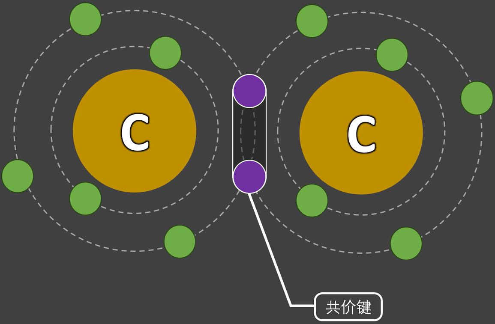 

对于石墨：

一个碳原子会和周围的三个碳原子组合，形成一个**自由电子**，可在四个碳原子之间随意运动，因此石墨是**导电**的

石墨每层容易滑动，可用于润滑剂、铅笔芯

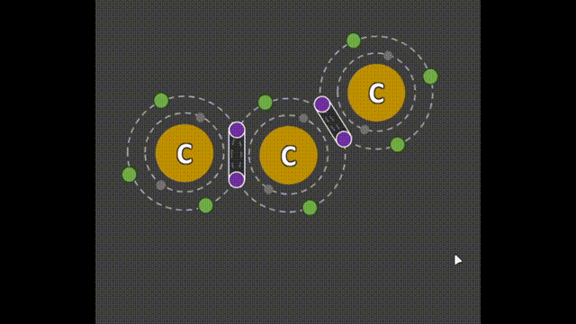 

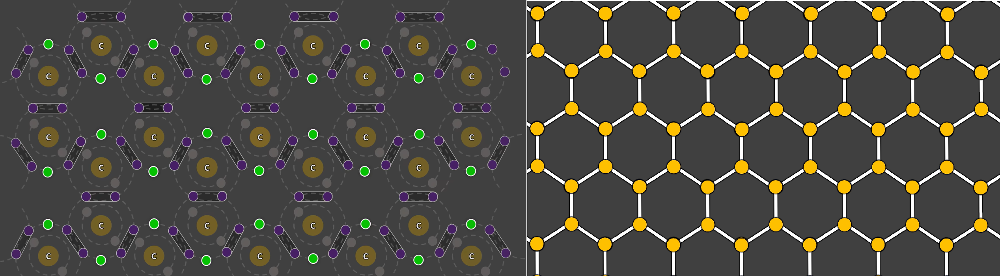  

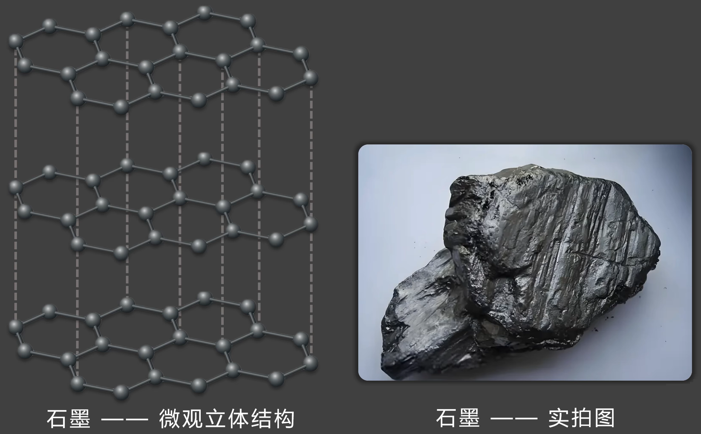 

对于金刚石：

一个碳原子会和周围的四个碳原子组合，没有形成自由电子，因此金刚石是**不导电**的

金刚石是一个立体结构，非常稳定，非常坚硬

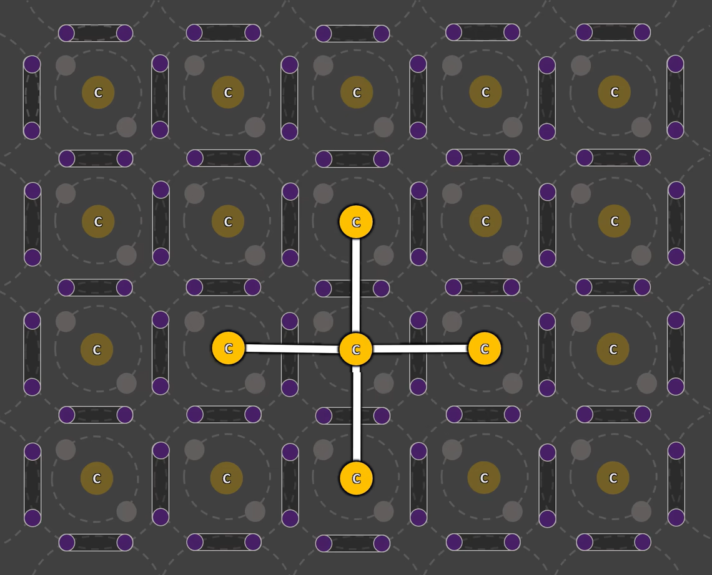 

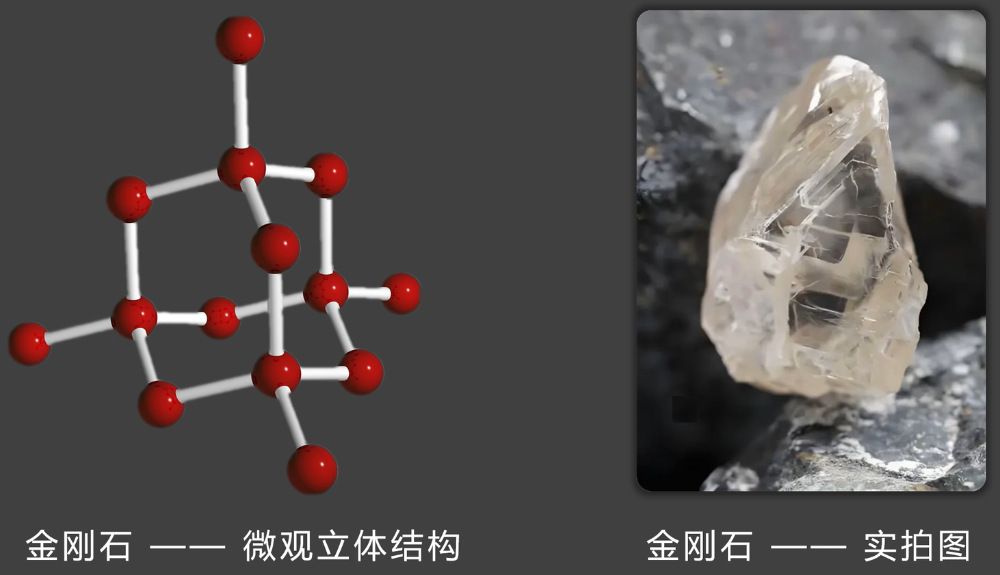 

# 02、电流

概念：**电荷**的**定向移动**，形成了电流，衡量电流的大小，要看**单位时间**内通过**导体横截面**的**电荷量**

方向：指**正电荷**的移动方向

​    对于金属导体，正电荷没有移动，是电子(负电荷)在定向移动

​    因此，**电流方向**与**电子移动方向**是相反的

单位：安培(A)，简称：安

​    1A的含义：在1秒钟内有 $6.242*10^{18}$ 个单位电荷通过了导体的横截面 (电子、质子都是单位电荷)

​     $6.242*10^{18}$ 个单位电荷的总电量，为1库伦(C)

单位换算：进位为1000，例如$1A=1000mA$

​    纳安(nA)-->**微安(uA)**-->**毫安(mA)**-->**安(A)**-->千安(kA)-->兆安(MA)-->吉安(GA)

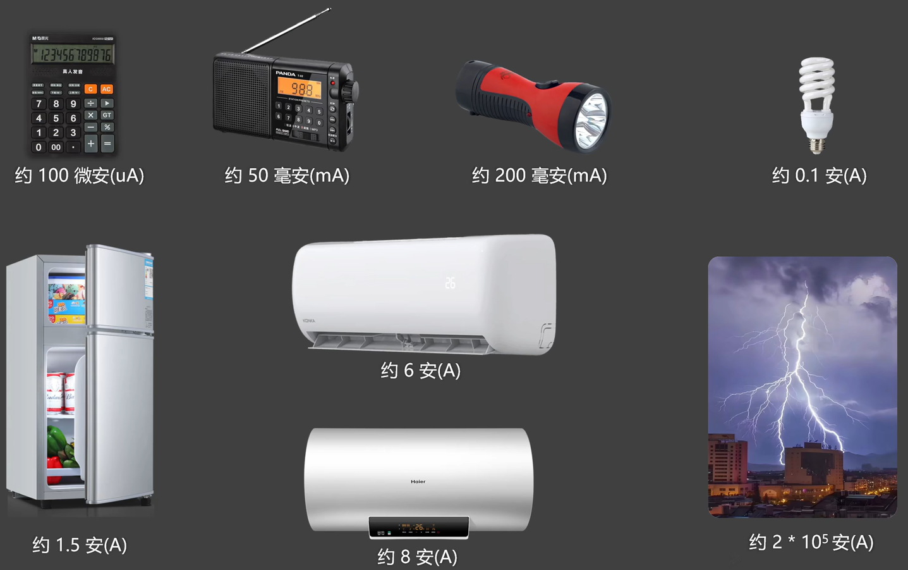 

# 03、电场、电势、电势能

类比：重力场、重力势、重力势能

| 重力势能： 1.物体在重力场中所具备的能量 2.与所处位置、物体质量、均有关 | 电势能： 1.带电粒子在电场中所具备的能量 2.与所处位置、粒子带电量、均有关 |
| ------------------------------------------------------------ | ------------------------------------------------------------ |
| 重力势： 1.重力场中某个位置给物体“赋予重力势能”的本领 2.与物体质量无关，与位置有关，是重力场的特性 | 电势： 1.电场中某个位置给带电粒子“赋予电势能”的本领 2.与粒子带电量无关，与位置有关，是电场的特性 |
| 重力场： 1.方向：由高重力场指向低重力场                 | 电场： 1.方向：由高电场指向低电场                       |

正电荷中心的电势为+∞，距离正电荷越远，电势越小，距离正电荷无穷远处的电势为0

负电荷中心的电势为-∞，距离负电荷越远，电势越大，距离负电荷无穷远处的电势为0

# 04、电压

概念：两点之间电势的差值(**电势差**)，衡量电压的大小，要看两点电势差的大小

​    有了电压，电子才能持续且定向的移动起来，所以电压是形成电流的**必要条件**

​    电压越大，能“定向移动”起来的电子就越多，电流就会越大

​    有电压就会有电流吗？有电压的同时，还需形成**回路**才能有电流

单位：伏特(V)，简称：伏

​    1V的含义：**电场**对**1库伦(C)**电荷，做了**1焦耳(J)**的**功**

单位换算：进位为1000，例如1kV=1000V

​    纳伏(nV)-->**微伏(uV)**-->**毫伏(mV)**-->**伏(V)**-->千伏(kV)-->兆伏(MV)-->吉伏(GV)

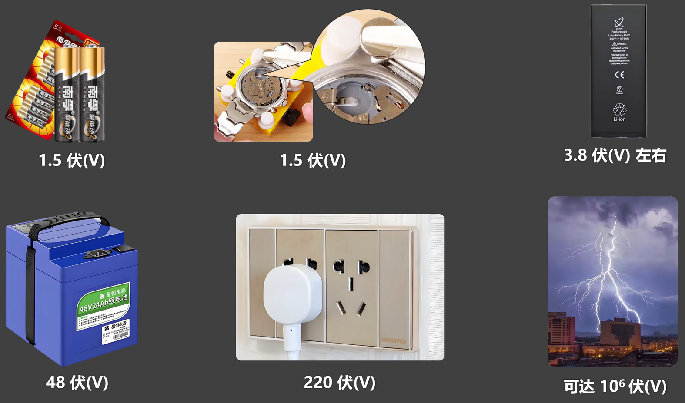 

# 05、电阻

导体虽然导电，但是对电流也有一定的**阻碍作用**

通过铜丝的电流较大，表明铜丝对电流的阻碍作用较小

通过镍铬合金丝的电流较小，表明其对电流的阻碍作用较大

 

概念：材料或元器件对**电流**流动的**阻碍**

单位：欧姆(Ω)，简称：欧

​    1Ω的含义：给导体施加1V电压，此时导体的电流如果为1A，那么该导体的电阻就是1Ω

单位换算：进位为1000，例如1Ω=1000mΩ

​    纳欧(nΩ)-->微欧(uΩ)-->毫欧(mΩ)-->**欧(Ω)**-->**千欧(kΩ)**-->**兆欧(MΩ)**-->吉欧(GΩ)

电阻的决定式：$R = \rho * \frac{L}{A}$

​    其中，R指电阻；$\rho$指材料的电阻率(电阻率越大，对电流阻碍就越强)；L指导体的长度；A指导体的横截面积

​    电阻的大小不仅与材料有关，还与材料的粗细，长短等因素有关

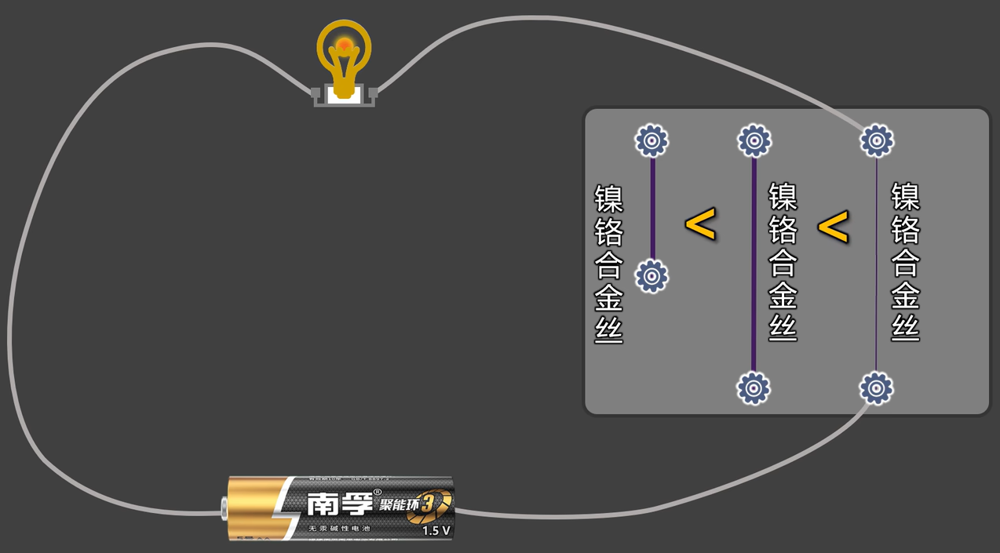 

电阻器：简称：电阻

​    专门用于控制电流的电子元器件

# 06、电路

通过导线把：电源、用电器，组合到一起，形成了电流可以流过的路径，就是电路

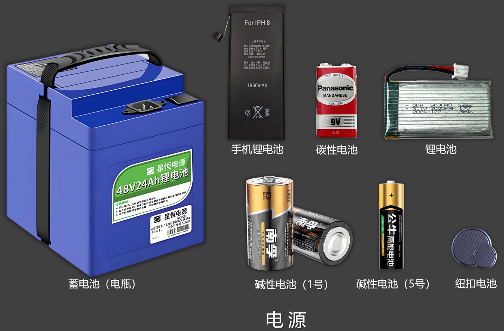 

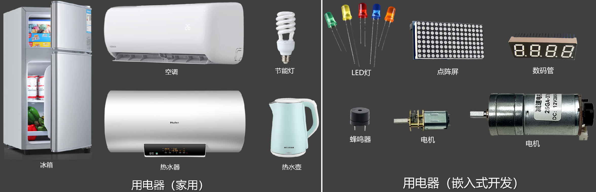 

常见元器件的图形符号

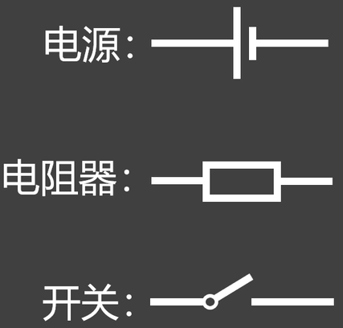 

常见的电路状态

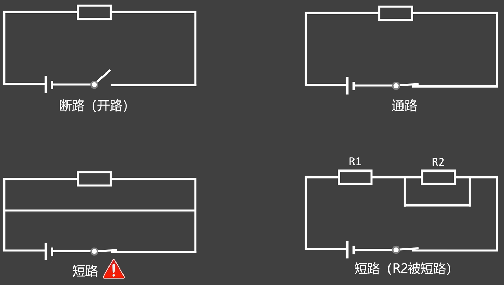  

# 07、欧姆定律

概念：导体中的电流与导体两端的电压成正比，与导体的电阻成反比。

公式：$I = \frac{U}{R}$

​    其中，I指电流，单位为A；U指电压，单位为V；R指电阻，单位为Ω

> 决定式与定义式：
>
> 决定式：用于描述一个物理量，到底**由什么决定**。
>
> ​    根据电阻的决定式，就可以通过电阻的固有属性(长度、横截面积、电阻率等)，对其进行定量分析。而不用将电阻接入电路，也不用依赖测量设备
>
> ​    电阻的决定式：$R = \rho * \frac{L}{A}$
>
> 定义式：用于描述一个物理量**是什么**，以及如何通过其他物理量，来测量或计算该物理量。依赖外部的测量条件(如电压、电流等)，需将元器件接入电路，通过实际测量，来根据公式定量分析物理量
>
> ​    电阻的定义式：$R = \frac{U}{I}$

变形公式(1)：$R = \frac{U}{I}$    变形公式(2)：$U = I R$

# 08、直流电与交流电

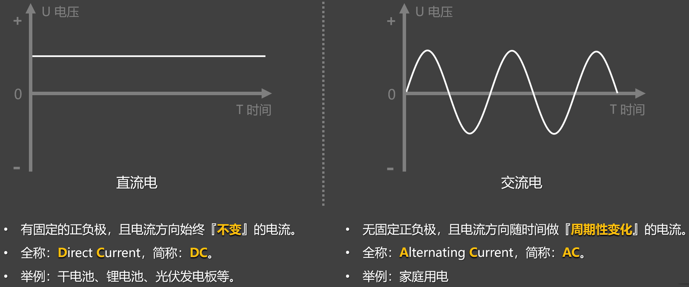 

纵坐标的正负号代表方向

关于交流电：

​    周期：交流电完成一个**完整**的波动循环所需的**时间**

​    峰值电压：交流电在一个周期中达到的最大电压值，220V交流电的峰值电压为：$220 \sqrt{2}$ 约为311V

​    有效电压：让交流电和直流电，分别通过同一个电阻，在交流电的一个周期内，若二者产生的热量相等，那么这个直流电的电压，就是交流电的有效电压

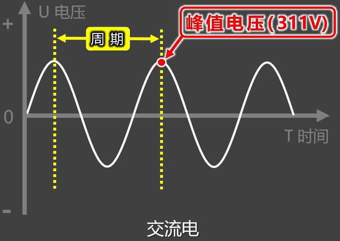 

交流(AC)-->直流(DC)：整流(Rectification)

直流(DC)-->交流(AC)：逆变(Inversion)

~指交流电

⎓指直流电

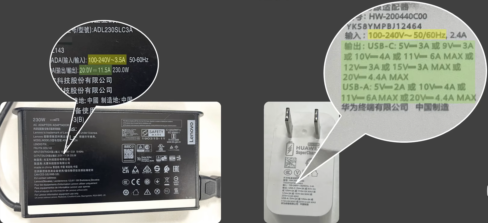 

关于家庭用电(220V50Hz)：

​    是**正弦交流电**

​    没有正负极之分，有零线、火线之分

​    零线的电势始终为0；火线的电势不断变化，这就形成了交变电流

​    家庭用电220V指交流电的有效电压

​    注意：我们常说的、用电器说明书上写的、电表所测的，都是有效电压

​    50Hz的含义：频率为50Hz，表示1秒钟内完成50个周期，每个周期包含2次方向的变化，所以家用交流电1秒钟内电流方向变化100次

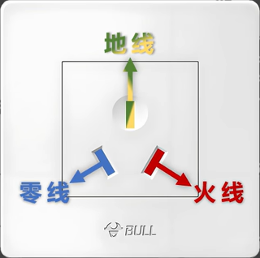 

# 09、弱电与强电

弱电：电压通常较低，一般不超过36V，基本

# 10、家庭电路(了解)

# 11、串联电路与并联电路

# 12、仿真软件初级使用

# 13、电功率

