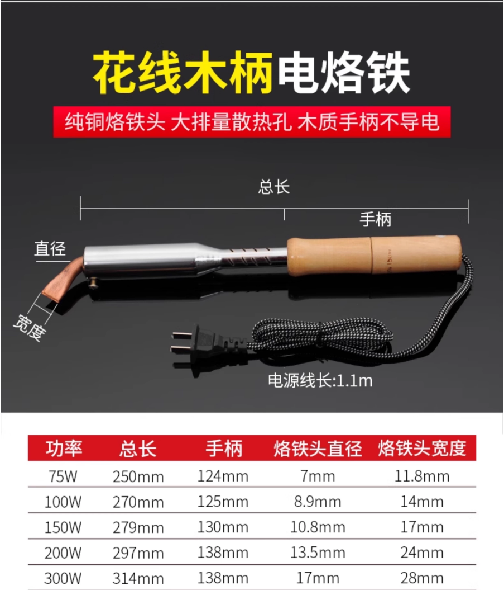
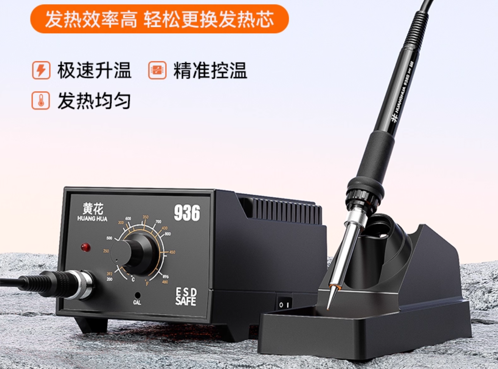
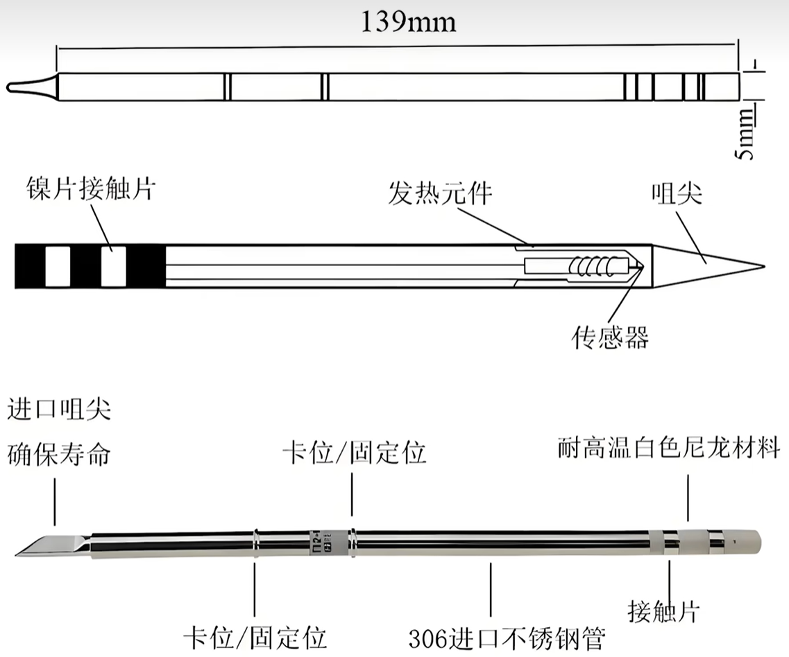
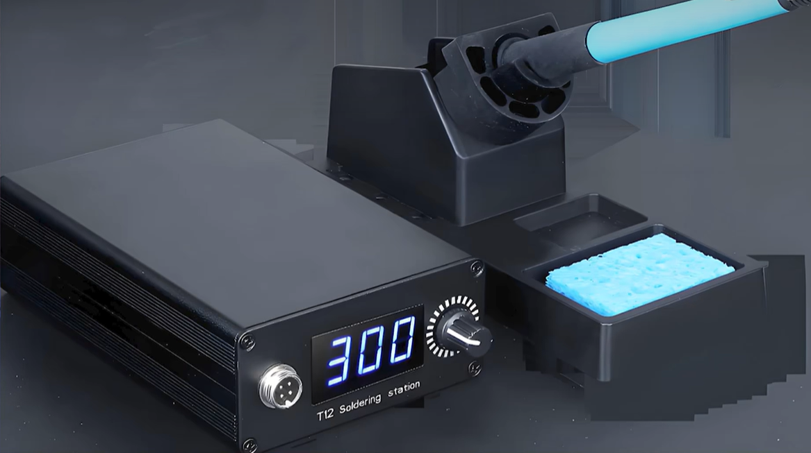
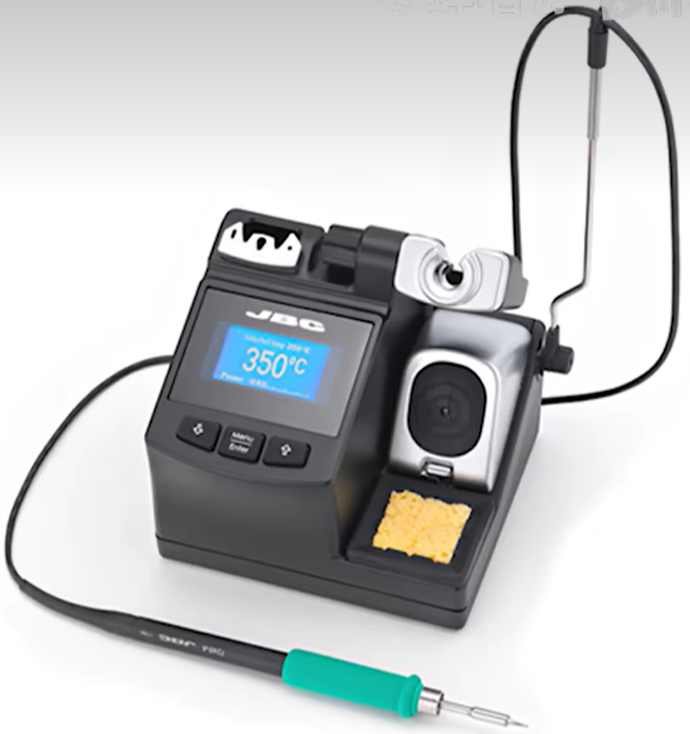
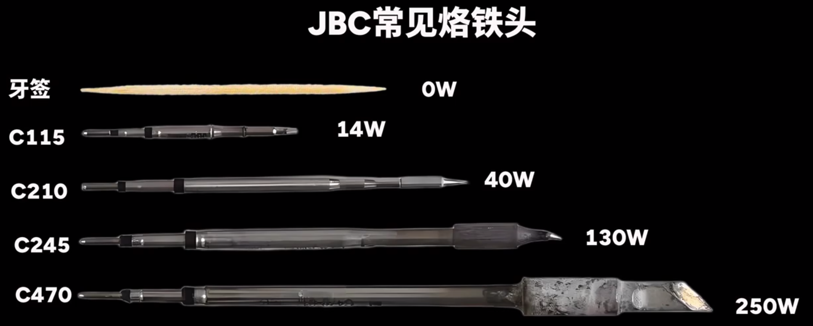
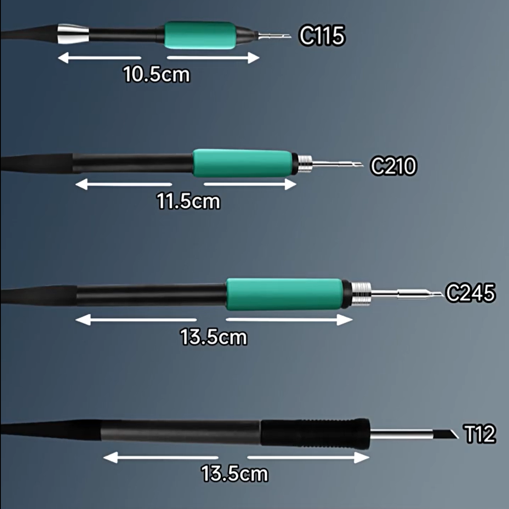

# 220V直插外热/内热电烙铁

 

# 可调温度936型电烙铁

最早是白光公司推出，由工频变压器供电，体积与重量较大，采用模拟控制，温度控制不直观，发热芯与测温模块在一起，与焊咀是分离的，回温效果和加热效果一般

 

# T12烙铁头电烙铁

发热芯与焊咀是一体的，结构简单，热效率高，回温效果好，控制部分一般采用单片机，可显示温度，一般采用开关电源，功率72W，体积小巧，改善了936的很多不足

 

 

# C245烙铁头电烙铁

最早由JBC公司推出，设计功率为130W

 

 

 